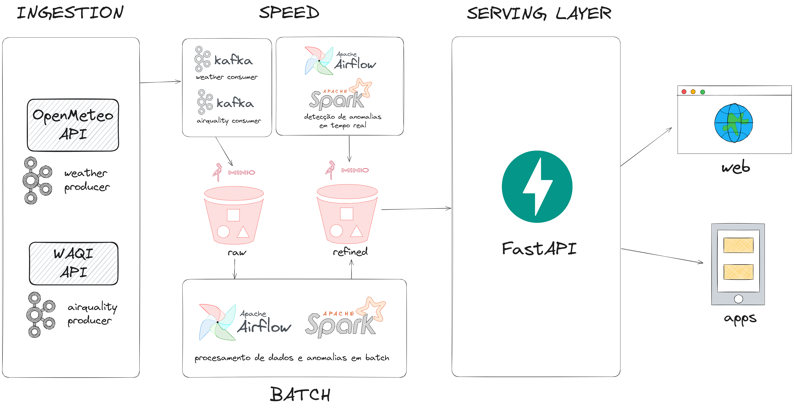

# 🌦️ Tempo e Qualidade do Ar

**Rafael Soares de Oliveira**  
Feito para o Projeto de Bloco: Engenharia de Dados: Big Data [25E1_5]` do Infnet  
https://github.com/RafaelOlivra/projeto-de-bloco-engenharia-de-dados-big-data  
Junho de 2025

Este projeto implementa um pipeline de dados para coleta, processamento e disponibilização de informações meteorológicas e de qualidade do ar, utilizando a **Arquitetura Lambda** com tecnologias modernas como Kafka, Spark, MinIO, Airflow e FastAPI.

---

## Objetivo

Criar um ambiente escalável para ingestão, processamento em tempo real e em lote de dados ambientais (clima e qualidade do ar), permitindo análises históricas e consultas em tempo real por meio de uma API.

---

## Arquitetura Lambda

A **Arquitetura Lambda** combina duas abordagens de processamento:

-   **Speed Layer (tempo real)**: fornece respostas rápidas com dados recentes.
-   **Batch Layer (lote)**: fornece resultados completos e consistentes a partir de dados históricos.
-   **Serving Layer**: expõe os dados para uso externo, como APIs, dashboards e análises.

---

## Iniciar o Projeto

Atualize o arquivo `.env.example` com seus dados, renomeie o arquivo para `.env` e então rode o
script `start.sh`.  
Esse script baixará todos os Jars necessários automaticamente.
